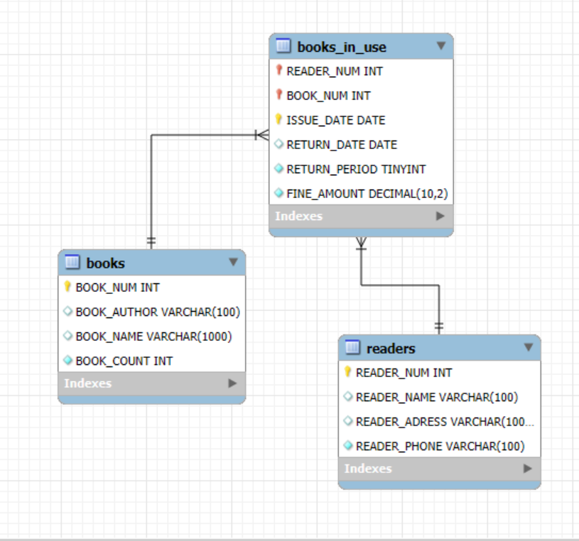

**"Создание базы данных для библиотеки"**

Для удобства интерпретации SQL-коды, описание задач, пояснения сохранены в файле jupyter notebook [SQL_library](SQL_library.ipynb).  
База данных создавалась в MySQL Workbench. 

Цель: необходимо хранить информацию о читателях (номер читательского билета, ФИО, адрес, телефон), хранимых книгах (шифр, автор, название, количество экземпляров), а также о выдаче книг на руки с указанием даты выдачи и срока возврата, размере штрафа в случае просрочки.

В результате получилась следующая структура нашей БД:  

